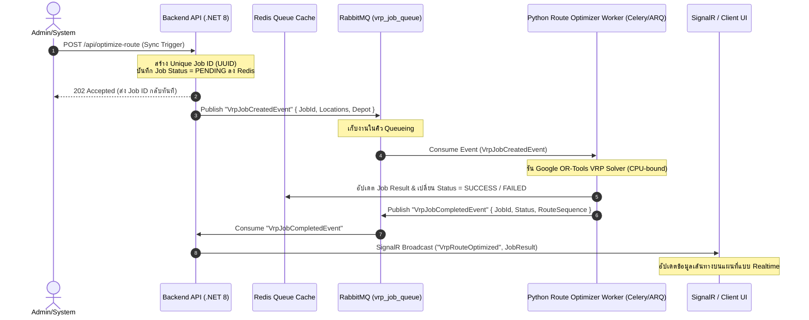

# [Dev Team] VRP Job Queue Architecture Design (Phase 2 - Documents/development/AI-QUEUE-DESIGN.md)

เอกสารนี้ระบุรายละเอียดการออกแบบเชิงสถาปัตยกรรม (Architecture Design Specifications) สำหรับการขยายขีดความสามารถการคำนวณเส้นทางด้วยปัญญาประดิษฐ์ (AI-Engine VRP Optimization) จากสถาปัตยกรรม Synchronous API ไปเป็น **Asynchronous Job Queue** ในเฟสถัดไป เพื่อตอบสนองต่อสภาวะโหลดงานสูง (High RPS / Peak Hours) โดยไม่ทำให้เกิดปัญหา Gateway Timeout (504) หรือทรัพยากรระบบพังทลาย

---

## 1. System Topology Overview

ในสถาปัตยกรรม Phase 2, การเรียกประมวลผลเส้นทาง (Vehicle Routing Problem - VRP) จะถูกแยกออกจากวงจร Request-Response หลักของ HTTP โดยสิ้นเชิง โดยใช้ Message Broker (RabbitMQ) และ Distributed Worker Pool (Celery หรือ ARQ) ในการรับงานไปประมวลผลเบื้องหลัง



---

## 2. Infrastructure Components

### 2.1 Message Broker: RabbitMQ
- **Exchange:** `delivery.ai.exchange` (Topic Exchange)
- **Queues:**
  - `ai.vrp.jobs`: คิวหลักสำหรับรับ payload ตำแหน่งไปประมวลผล VRP
  - `ai.vrp.results`: คิวตอบกลับสำหรับส่งผลการประมวลผลกลับไปยัง Backend
- **QoS Prefetch Limit:** ตั้งค่า `prefetch_count = 1` ต่อ Worker process เพื่อป้องกันความร้อนสะสมบน CPU (ASUS ROG/Dev environment) และเกลี่ยภาระงานแบบ Fair-share

### 2.2 Shared Cache & Job Store: Redis
- **Data Schema:**
  - Key: `ai:job:{JobId}` (Hash)
    - `status`: `PENDING` | `PROCESSING` | `SUCCESS` | `FAILED`
    - `payload`: raw locations & params
    - `result`: optimized route list (JSON)
    - `error`: error details if failed
  - **TTL:** 1 ชั่วโมง (`3600` วินาที) เพื่อลดภาระการจัดเก็บสะสม

### 2.3 Distributed Worker Pool: Python Celery / ARQ
- **Worker Environment:** รันด้วย Python 3.11-slim
- **Framework:** Celery (ใช้ Redis เป็น Result Backend และ RabbitMQ เป็น Broker) หรือ ARQ (Lightweight Async Redis Queue)
- **Concurrency Mode:** `solo` หรือกำหนดจำนวน `concurrency = CPU_CORES - 1` เพื่อเว้นช่องว่างให้ OS/Docker System ประมวลผลงานส่วนอื่น ๆ ได้อย่างเสถียร

---

## 3. API Contracts (Asynchronous Interface)

### 3.1 Submit VRP Request
**Endpoint:** `POST /api/v1/optimize-route/async`

**Headers:**
`X-API-Key: DeliverySmartRoutingSystem_AiEngine_ApiKey_2026`

**Request Body:**
```json
{
  "locations": [
    {"id": "depot", "lat": 17.4138, "lng": 102.7872},
    {"id": "loc_1", "lat": 17.4150, "lng": 102.7900},
    {"id": "loc_2", "lat": 17.4185, "lng": 102.7935}
  ],
  "num_vehicles": 1,
  "depot": 0
}
```

**Response (202 Accepted):**
```json
{
  "jobId": "e2f1837a-e421-4d32-8411-bc66eeefc3b1",
  "status": "PENDING",
  "submittedAt": "2026-06-11T11:05:53Z",
  "checkStatusUrl": "/api/v1/optimize-route/status/e2f1837a-e421-4d32-8411-bc66eeefc3b1"
}
```

### 3.2 Poll Job Status
**Endpoint:** `GET /api/v1/optimize-route/status/{jobId}`

**Response (Processing):**
```json
{
  "jobId": "e2f1837a-e421-4d32-8411-bc66eeefc3b1",
  "status": "PROCESSING",
  "updatedAt": "2026-06-11T11:06:10Z"
}
```

**Response (Success):**
```json
{
  "jobId": "e2f1837a-e421-4d32-8411-bc66eeefc3b1",
  "status": "SUCCESS",
  "durationMs": 750,
  "optimized_route": [
    {"location_id": "depot", "sequence": 0},
    {"location_id": "loc_1", "sequence": 1},
    {"location_id": "loc_2", "sequence": 2}
  ]
}
```

---

## 4. SignalR Real-time Event Delivery

เมื่อ Worker ประมวลผลเส้นทางเสร็จสิ้น Backend API จะรับ Event จาก RabbitMQ และยิงสัญญาณแจ้งเตือนหน้าบ้านทันทีผ่าน SignalR Hub:

- **Hub Name:** `TrackingHub`
- **Method Name:** `ReceiveOptimizedRoute`
- **Payload:**
```json
{
  "jobId": "e2f1837a-e421-4d32-8411-bc66eeefc3b1",
  "status": "SUCCESS",
  "routeSequence": [
    {"location_id": "depot", "sequence": 0},
    {"location_id": "loc_1", "sequence": 1},
    {"location_id": "loc_2", "sequence": 2}
  ]
}
```

---

## 5. Security & DoS Mitigation Checklist

1. **Maximum Request Size Limiter:** จำกัดจำนวนพิกัดสูงสุดต่อ async request ไว้ที่ 100 จุด (เหมือนเฟส 1) เพื่อป้องกันการจงใจโจมตีแบบ DoS (Model DoS / CPU Exhaustion)
2. **Rate Limiting:** จำกัดการยื่นสร้าง Job สำหรับ Client แต่ละตัวไว้ที่ 2 jobs ต่อวินาที ผ่านระบบ Middleware ของ Backend
3. **Graceful Worker Timeout:** กำหนด Hard Time Limit บน Celery/ARQ ไว้อยู่ที่ `10` วินาที หาก OR-Tools ประมวลผลล่าช้าเกินกำหนด คอนเทนเนอร์จะสั่ง Kill task และคืนสถานะ FAILED กลับไปยัง Backend ทันที ป้องกันปัญหาระบบค้างสะสม
