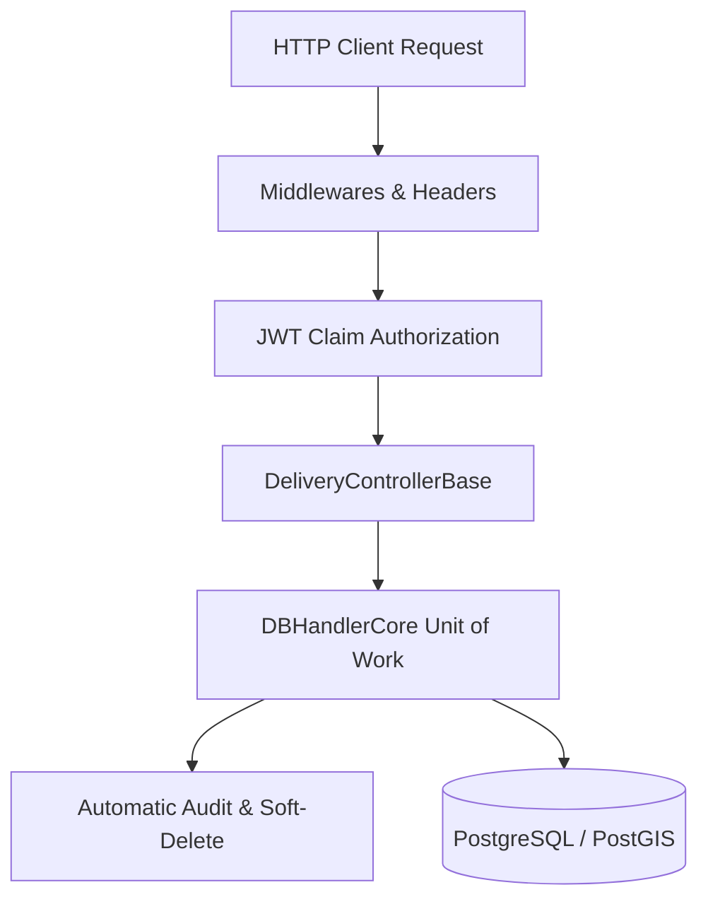

# 🏛️ Core Codebase Patterns & Architecture Technical Manual (Documents/development/CODEBASE_PATTERNS/README.md)

> [!NOTE]
> เอกสารคู่มือทางวิศวกรรมซอฟต์แวร์ระดับลึก (Deep-dive Engineering Patterns) ฉบับนี้ รวบรวมรูปแบบโครงสร้างการเขียนโค้ดเบส (Codebase Design Patterns) ของทั้งระบบแยกย่อยเป็นโฟลเดอร์เพื่อให้อ่านง่ายไม่บวมสะสม เพื่อประยุกต์เป็นกรอบปฏิบัติสำหรับทีมผู้พัฒนาในการส่งต่อระบบ (Handover)

---

## 📚 สารบัญรูปแบบสถาปัตยกรรม (Codebase Architecture Patterns Index)

---

## 🏛️ สารบัญโมดูลย่อย (Sub-module Index)

กรุณาคลิกลิงก์ด้านล่างเพื่อศึกษารายละเอียดของแต่ละรูปแบบสถาปัตยกรรมการเขียนโค้ด:

1. **Base Controller Pattern**  
   👉 [base-controller.md](base-controller.md) — คลาสพื้นฐาน `DeliveryControllerBase` และการทำ Lazy-loading Dependency Resolution
2. **Base Service & Unit of Work Pattern**  
   👉 [base-service-uow.md](base-service-uow.md) — คลาส `DBHandlerCore` การสร้างระบบบันทึก Audit และ Soft Delete อัตโนมัติด้วย Reflection
3. **Security Headers & Middleware Handling**  
   👉 [security-middlewares.md](security-middlewares.md) — รายละเอียดระบบ Correlation ID, CSRF Validation (Double-Submit Cookie) และ Security Headers
4. **Fluent API & Validation Pattern**  
   👉 [validation-spatial-index.md](validation-spatial-index.md) — ตัวกรอง `ValidationFilter` ร่วมกับ FluentValidation และการจัดทำ Spatial GiST Index ในฐานข้อมูล
5. **Mapster Mapping & Spatial Auto-Generation**  
   👉 [mappings-spatial-generation.md](mappings-spatial-generation.md) — การ Mapping โมเดล DTO ↔ Entity และความปลอดภัยในการบังคับพิกัด 2D (XY point force logic)
6. **FastAPI Anti-Blocking Threading**  
   👉 [fastapi-threading.md](fastapi-threading.md) — สถาปัตยกรรม Python FastAPI ป้องกัน Event loop ค้างจากงานประมวลผลคำนวณ VRP (CPU-bound)
7. **Pure Transport Hub Pattern (SignalR Hub Core)**  
   👉 [signalr-hubs.md](signalr-hubs.md) — คลาส `TrackingHub` ที่กำหนดให้เป็น Pure Transport Layer เท่านั้น ไร้ Business Logic ฝัง
8. **Automatic Database Migration & Seeding**  
   👉 [db-migration-seeding.md](db-migration-seeding.md) — ระบบ Auto-Migration และ Seed ข้อมูลจำลองตอน Startup **พร้อมคำเตือนวิกฤต Deadlock บน Production แบบ Multi-instance**
9. **Automatic OpenAPI/Swagger Generation**  
   👉 [openapi-swagger-generation.md](openapi-swagger-generation.md) — ระบบ Auto-gen ไฟล์ `swagger.json` อัตโนมัติหลัง Build ในโหมด Release/Auto-gen
10. **ThreadPool Starvation Prevention**  
    👉 [threadpool-starvation.md](threadpool-starvation.md) — การจอง Threads พื้นฐานขั้นต่ำ (`SetMinThreads(1000, 1000)`) ป้องกันคอขวดตอนยิง GPS ถล่ม
11. **Custom Dotenv Variable Mapping**  
    👉 [dotenv-mapping.md](dotenv-mapping.md) — การ Mapping ตัวแปรสภาพแวดล้อมข้ามระบบระหว่าง `__` (ดับเบิ้ลอันเดอร์สกอร์) เป็นเครื่องหมาย `:` ของฝั่ง .NET
12. **RabbitMQ Idempotent Consumers**  
    👉 [rabbitmq-idempotency.md](rabbitmq-idempotency.md) — ตาราง `ProcessedEvents` ป้องกันการทำลอจิกเบิ้ลพร้อมระบบ Maintenance Worker ล้างประวัติอัตโนมัติ
13. **Race Condition & Concurrency Locking**  
    👉 [concurrency-locking.md](concurrency-locking.md) — ระบบล็อก 3 ชั้น: Redis Distributed Lock (Lua safe release), PostgreSQL fallback atomic UPSERT lock, และ EF Core RowVersion concurrency check
14. **Frontend Reactive UI & Memory Leak Prevention**  
    👉 [frontend-reactive-teardowns.md](frontend-reactive-teardowns.md) — การอัปเดตแบบ reactive และการสั่ง Teardown ล้าง RAM ทิ้งของ Leaflet map, SignalR sockets และ RxJS Subscriptions
15. **Unified Trace Correlation Logging**  
    👉 [trace-correlation-logs.md](trace-correlation-logs.md) — กฎการผูกโยง Logs ด้วยพารามิเตอร์ `CorrelationId`, `OrderId` และ `RiderId` ตลอดเส้นทาง
16. **SQLite Local Database & Offline Buffering**  
    👉 [sqlite-local-db.md](sqlite-local-db.md) — โครงสร้างฐานข้อมูลสำรองจีพีเอสออฟไลน์ ตาราง `pending_gps_points` ระบบจำกัดขนาดแถวด้วย FIFO ท้องถิ่น และการทำ Web Guard Fallback
17. **GoRouter Role-Based Access Control**  
    👉 [gorouter-rbac.md](gorouter-rbac.md) — โครงสร้างควบคุมความปลอดภัยของเส้นทางในแอปพลิเคชันมือถือ บทบาทคัดแยกกลุ่มสิทธิ์ และระบบ Refresh เปลี่ยนหน้าล็อกอินอัตโนมัติ
18. **Unified REST API Response Wrapper**  
    👉 [api-response-wrapper.md](api-response-wrapper.md) — ตัวกรอง `GlobalResponseFilter` ครอบโครงสร้าง JSON ขากลับแบบอัตโนมัติ และแท็ก `[DisableWrapper]` ปิดงานครอบ

