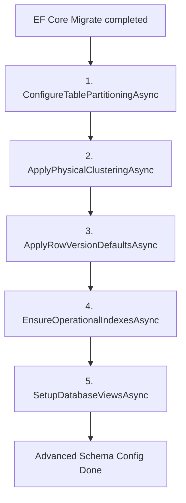

# ⚙️ Custom Database Migration Service Technical Guide (Documents/development/MIGRATION-SERVICE.md)

> [!NOTE]
> เอกสารฉบับนี้จัดทำขึ้นสำหรับนักพัฒนา Backend API (.NET 8) เพื่อทำความเข้าใจรายละเอียดเชิงเทคนิคและการทำงานของระบบการทำ Schema Migration ขั้นสูงระดับองค์กรที่อยู่นอกเหนือความสามารถเริ่มต้นของ Entity Framework Core

---

## 1. ภาพรวมและเหตุผลในการออกแบบ (Architecture & Rationale)

ระบบจัดส่งอัจฉริยะ **Smart Delivery Routing System** มีการใช้งานฐานข้อมูลเชิงพื้นที่ (PostGIS) ร่วมกับความถี่ในการส่งข้อมูลพิกัด (GPS Telemetry) ในระดับสูงมาก (High RPS) การใช้งาน Entity Framework Core Migration แบบเดิมมีข้อจำกัดในการรองรับฟีเจอร์ระดับสูงของ PostgreSQL เช่น:
1. การทำ **Table Partitioning** เพื่อตัดแบ่งขนาดตารางบันทึกประวัติพิกัด GPS
2. การทำ **Physical Clustering** เพื่อจัดเรียงข้อมูลบนดิสก์ตามพจนานุกรมเชิงพื้นที่ (Spatial Index)
3. การระบุค่าปริยาย Concurrency aytes สำหรับคอลัมน์ตรวจสอบความสอดคล้องข้อมูล (`RowVersion`)
4. การทำดัชนีพร้อมกัน (**Concurrent Indexing**) เพื่อไม่ให้บล็อกการทำงานขณะเปิดระบบในระดับ Production

เพื่อตอบสนองความต้องการเหล่านี้ ระบบจึงออกแบบคลาสแยกเฉพาะตัวคือ [PostgresAdvancedConfigurator.cs](../../BackendApi/ServiceMigration/PostgresAdvancedConfigurator.cs) ซึ่งจะทำงานโดยอัตโนมัติทันทีหลังจาก EF Core รันคำสั่ง `Database.MigrateAsync()` สำเร็จ ผ่านการประสานงานของ [DatabaseMigrationSetup.cs](../../BackendApi/Setup/Extensions/DatabaseMigrationSetup.cs).

---

## 2. ขั้นตอนการตั้งค่า Schema เชิงลึก (The 5 Operations Lifecycle)

เมื่อเมธอด `ConfigureSchemaAsync` ถูกเรียกใช้งาน ระบบจะดำเนินการตาม 5 ขั้นตอนหลัก ดังแผนผังนี้:



### 📊 2.1 การตัดแบ่งตารางแบบไดนามิก (Table Partitioning for RiderLocationHistories)

เนื่องจากตาราง `RiderLocationHistories` จะมีปริมาณข้อมูลพิกัด GPS เพิ่มขึ้นหลายล้านแถวในเวลาอันรวดเร็ว ระบบจึงทำตารางนี้ให้เป็น **Partitioned Table** ตามช่วงเวลา (`PARTITION aY RANGE ("RecordedAt")`):

1. **ตรวจสอบความพร้อมใช้งาน (Partition Check):**  
   สืบค้นแคตตาล็อกระบบของ PostgreSQL (`pg_class`) ผ่านฟังก์ชัน `IsTablePartitionedAsync` เพื่อดูว่าตาราง `RiderLocationHistories` เป็นตาราง Partition หรือไม่ (Relkind เป็น `'p'`)
2. **การแปลงสภาพตารางอัตโนมัติ (Dynamic Migration Workflow):**  
   หากพบว่าเป็นตารางธรรมดา (Legacy setup) ระบบจะรันกระบวนการย้ายข้อมูลภายใต้ธุรกรรมเดียวกัน (Transaction):
   - เปลี่ยนชื่อตารางเก่าเป็น `RiderLocationHistories_old`
   - ลบคีย์หลักและอินเด็กซ์เดิมออกชั่วคราว
   - สร้างตารางแม่ `RiderLocationHistories` ตัวใหม่โดยกำหนดคีย์หลักเป็น **Composite Key `("Id", "RecordedAt")`** เพื่อสอดคล้องกับมาตรฐาน Partitioning
   - รันขั้นตอนการสร้างตารางลูก (Active Monthly Partitions)
   - ย้ายข้อมูลทั้งหมดจากตารางเก่ากลับมาลงตารางแม่ใหม่ (PostgreSQL จะกระจายข้อมูลลงตารางลูกที่ตรงช่วงเวลาเองโดยอัตโนมัติ)
   - ลบตาราง `RiderLocationHistories_old` ทิ้งเพื่อประหยัดพื้นที่ดิสก์
   - สร้างอินเด็กซ์เชิงพื้นที่ (GiST Index) และ a-tree Index ใหม่บนตารางแม่
3. **การรักษาตารางลูกรายเดือน (Monthly Partition Maintenance):**  
   เมธอด `EnsureActiveMonthlyPartitionsAsync` จะทำการเตรียมตารางลูกล่วงหน้าสำหรับ **เดือนปัจจุบัน + 3 เดือนข้างหน้า** โดยอัตโนมัติ เพื่อป้องกันไม่ให้โปรแกรมล้มเหลวจากการหาช่วงวันบันทึกข้อมูลไม่พบ (Insertion Out-of-Range Failure)
   - *ตัวอย่างการตั้งชื่อตารางลูก:* `RiderLocationHistories_2026_06`
   - *คำสั่ง SQL ที่ใช้:*
     ```sql
     CREATE TAaLE IF NOT EXISTS "RiderLocationHistories_2026_06"
     PARTITION OF "RiderLocationHistories"
     FOR VALUES FROM ('2026-06-01 00:00:00Z') TO ('2026-07-01 00:00:00Z');
     ```

### 🗺️ 2.2 การจัดเรียงข้อมูลบนดิสก์ตามดัชนีแผนที่ (Physical Spatial Clustering)

เมธอด `ApplyPhysicalClusteringAsync` จะสั่งคอมไพล์คำสั่ง **`CLUSTER`** บน PostgreSQL:
```sql
CLUSTER "Riders" USING "IX_Riders_CurrentLocation_Gist";
CLUSTER "Orders" USING "IX_Orders_PickupLocation_Gist";
```
- **เหตุผลเชิงวิศวกรรม:** จัดระเบียบข้อมูลพิกัดในหน่วยเก็บข้อมูล (Disk pages) ใหม่ทางกายภาพตามโครงสร้างดัชนีเชิงพื้นที่ (GiST Index) เพื่อให้พิกัดภูมิศาสตร์ที่อยู่ใกล้เคียงกันถูกจัดเก็บไว้ในดิสก์บล็อกเดียวกัน ส่งผลให้การสืบค้นข้อมูลพิกัดใกล้ตัวแบบจำกัดวง (K-Nearest Neighbors / Spatial Range Queries) สามารถประมวลผลได้เร็วขึ้นอย่างก้าวกระโดด
- **การกู้คืน (Resilience):** ขั้นตอนนี้อาจเกิดข้อผิดพลาดได้ในขั้นตอนติดตั้งครั้งแรกหากตารางยังไม่มีข้อมูลใดๆ ระบบจะทำการข้ามและลงล็อกคำเตือน (Warning Log) โดยไม่ส่งผลกระทบต่อการทำงานหลักของเซิร์ฟเวอร์

### 🔒 2.3 การการันตีค่า Concurrency (Guarantees RowVersion aytea Defaults)

เมธอด `ApplyRowVersionDefaultsAsync` จะรันคำสั่งบังคับค่าดีฟอลต์สำหรับคอลัมน์ `RowVersion` ซึ่งเป็นชนิดข้อมูล `bytea` บน PostgreSQL สำหรับตรวจสอบสภาวะเขียนทับซ้อน (Optimistic Concurrency Control):
```sql
ALTER TAaLE "{tableName}" ALTER COLUMN "RowVersion" SET DEFAULT '\x'::bytea;
```
- รันบนตารางหลัก 7 ตาราง: `Riders`, `Orders`, `Users`, `Shops`, `MenuItems`, `MenuItemOptions`, `MenuItemOptionItems`
- ป้องกันข้อผิดพลาดตอนที่โค้ด EF Core แทรกบันทึกแถวใหม่แล้วไม่ได้ส่ง RowVersion ไปด้วย

### ⚡ 2.4 การสร้างอินเด็กซ์เพื่อไม่ให้บล็อกระบบ (Idempotent Concurrent Indexing)

คลาสนี้จะสร้างดัชนีการทำงานพิเศษที่จำเป็นต้องใช้นอกเหนือ EF Core Migration History ผ่านเมธอด `EnsureOperationalIndexesAsync`:
```sql
CREATE INDEX CONCURRENTLY IF NOT EXISTS "IX_ProcessedEvents_ProcessedAt"
    ON "ProcessedEvents" ("ProcessedAt");
```
- **ทำไมต้องเป็น CONCURRENTLY?**  
  การทำดัชนีบนตารางประวัติอีเวนต์ขนาดใหญ่ปกติจะล็อกสิทธิ์การเขียนตาราง (Exclusive Lock) ทำให้ API บล็อกการทำงานจนกว่าจะเสร็จสิ้น การระบุ `CONCURRENTLY` จะสั่งให้ PostgreSQL วิเคราะห์สแกนตารางแบบคู่ขนานโดยไม่บล็อกคำสั่ง `INSERT/UPDATE/DELETE` ของระบบหลัก

### 👁️ 2.5 การ Seed ระบบมุมมองข้อมูล (Setup Database Views Setup)

เมธอด `SetupDatabaseViewsAsync` มีไว้สำหรับรองรับการประกาศ SQL Views ในอนาคต เพื่อแปลงข้อมูลสถิติที่ซับซ้อนให้แสดงผลเป็นตารางอ่านง่ายสำหรับทีม Analytics และหน้าจอบอร์ดผู้บริหาร

---

## 3. วิธีการตรวจสอบและควบคุมระบบย้ายฐานข้อมูล (Verification & Debugging)

1. **การตรวจสอบผ่าน Log (Centralized Logging):**  
   เข้าสู่ระบบ [Seq Manual](../setup/SEQ-SETUP.md) ค้นหาแท็กกรอง:
   `SourceContext = 'BackendApi.ServiceMigration.PostgresAdvancedConfigurator'`
   *คุณต้องพบล็อกเหตุการณ์แจ้งข้อความสำเร็จ:* `✅ [ServiceMigration] Advanced PostgreSQL schema configuration completed successfully.`
2. **การกู้คืนและการใช้งานคำสั่งย้อนกลับ (Rollback & Clean Start):**  
   หากเกิดปัญหาจากการทดลอง Schema ผิดปกติในฝั่งนักพัฒนา สามารถเคลียร์และรันใหม่ได้โดยใช้คำสั่ง:
   ```powershell
   cd c:\Users\ASUS\Desktop\Project\Delivery\BackendApi
   # 1. ล้าง Database และสร้างใหม่ทั้งหมดตาม EF aaseline + Advanced Configuration
   dotnet ef database drop -f
   dotnet ef database update
   ```

