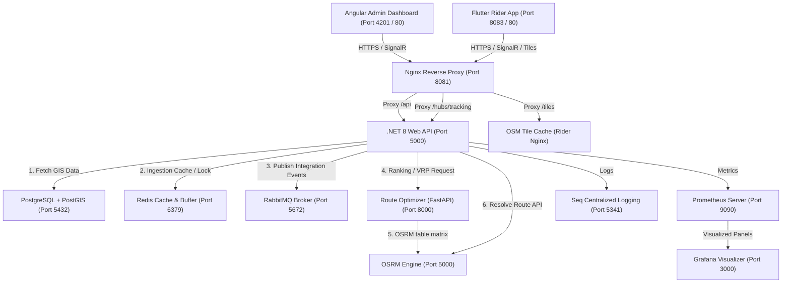
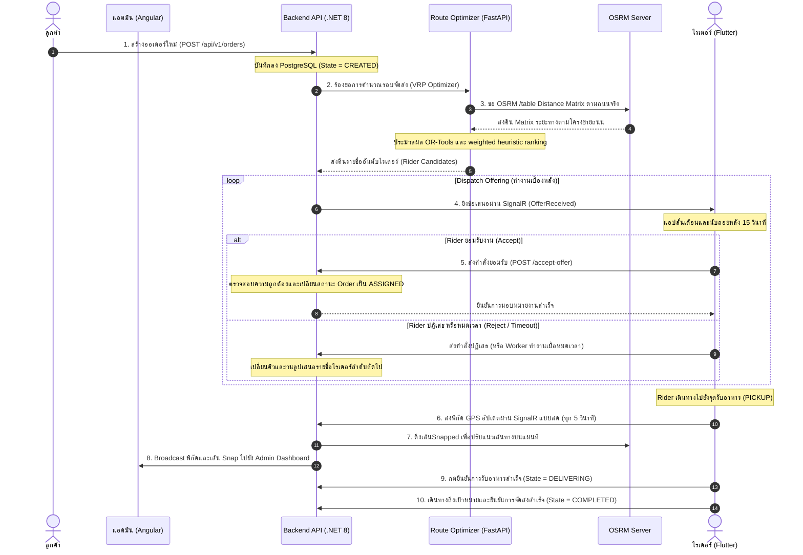
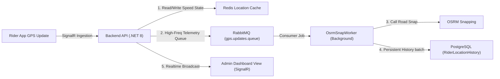

# System Overview & Architecture Diagram (Documents/development/SYSTEM-OVERVIEW.md)

เอกสารนี้แสดงสถาปัตยกรรมระดับสูง (High-Level Architecture) และท่อระบายข้อมูล (Data Flows) ของระบบจัดส่งอัจฉริยะแบบเรียลไทม์ (Smart Delivery Routing System) เพื่อให้ทีมพัฒนาและแอดมินระบบสามารถทำความเข้าใจโครงสร้างและการทำงานร่วมกันของแต่ละโมดูลได้โดยไม่ต้องสืบค้นเพิ่มเติม

---

## 1. System Topology & Communication Diagram

ระบบทั้งหมดทำงานอยู่บนสภาพแวดล้อม Docker-compose โดยมีการตัดขาดพอร์ตของตู้ภายใน (Internal Services) ออกจากเครือข่ายภายนอกเพื่อความปลอดภัย และปล่อยให้ทราฟฟิกขาเข้าผ่านเพียง Nginx Reverse Proxy เท่านั้น

---

## 2. โครงสร้างและการแมปพอร์ต (Service Port Mapping Catalog)

| บริการ (Service) | พอร์ตภายนอก (Dev Bind) | พอร์ตภายในตู้ | บทบาทและขอบเขตหน้าที่ |
| :--- | :---: | :---: | :--- |
| **nginx-proxy** | `8081` | `80` | ทางเข้าหลักของระบบ (Gateway) จัดการเส้นทางทราฟฟิกและบล็อก CORS |
| **backend** | `5000` | `80` | Core API พัฒนาด้วย .NET 8 ควบคุมโมเดลธุรกิจ, สิทธิ์ JWT และ SignalR Hub |
| **frontend** | `4201` | `80` | Angular 19 Admin Web สำหรับเฝ้าสถานการณ์ จัดการไรเดอร์และออเดอร์ |
| **rider-app** | `8083` | `80` | Flutter Web Client สำหรับจำลองพฤติกรรมและการทำงานของคนขับรถ |
| **route-optimizer** | `8009` | `8000` | FastAPI Engine คำนวณ VRP (Vehicle Routing Problem) ร่วมกับ Google OR-Tools |
| **osrm** | `5001` | `5000` | บริการคำนวณระยะทางและ Snap เส้นพิกัดเข้าถนนจริงเมืองอุดรธานี |
| **db** | `5432` | `5432` | ฐานข้อมูลถาวรเชิงพื้นที่ PostgreSQL 15 + PostGIS (SRID 4326) |
| **redis** | `6379` | `6379` | แคชความเร็วสูงระดับ RAM สำหรับเก็บพิกัดสดของไรเดอร์และ Distributed Lock |
| **rabbitmq** | `5672`, `15672` | `5672`, `15672` | ตัวรับส่งข้อความเหตุการณ์ในระบบ (Event Broker) เพื่อทำงานแบบ Async |
| **seq** | `8082`, `5341` | `80`, `5341` | ศูนย์รวมการตรวจและวิเคราะห์ Log โครงสร้างวัตถุ (Structured Logs) |
| **prometheus** | `9090` | `9090` | ตัวเก็บรวบรวมตัวชี้วัดประสิทธิภาพเชิงระบบและธุรกิจ (System Metrics) |
| **grafana** | `3000` | `3000` | หน้าจอแผงแสดงผลและสถิติ (Operations, Infrastructure, NOC) |
| **vault** | `8200` | `8200` | บริการเก็บรักษาค่าความลับและข้อมูลความปลอดภัย (Secrets Management) |

---

## 3. ลำดับเหตุการณ์และขั้นตอนการจัดส่ง (Core Delivery Lifecycle Flow)

กระบวนการตั้งแต่การสั่งอาหารของลูกค้าไปจนถึงการเดินทางจัดส่งของไรเดอร์ มีขั้นตอนการสื่อสารข้อมูลดังภาพจำลองนี้:

---

## 4. ท่อส่งข้อมูลติดตามและจัดเก็บตำแหน่งพิกัด (GPS Telemetry Stream Pipeline)

ตำแหน่ง GPS ของไรเดอร์จะถูกจัดส่งด้วยความถี่สูงเพื่อความแม่นยำในการนำทาง จึงมีการแบ่งช่องทางข้อมูลเพื่อป้องกันความเสียหายต่อประสิทธิภาพของฐานข้อมูลหลัก (PostgreSQL DB Starvation):

- **Redis Cache:** เก็บพิกัดละติจูด/ลองจิจูดล่าสุดและประวัติการออนไลน์ของไรเดอร์เพื่อการตอบสนองที่ฉับไว
- **PostgreSQL:** จะถูกบันทึกประวัติการขยับย้อนหลัง (History) ผ่านการทำงานแบบอะซิงโครนัสของ RabbitMQ Consumer เท่านั้น เพื่อป้องกันไม่ให้ทราฟฟิกการยิงพิกัด GPS เป็นจำนวนมากไปกระทบกับธุรกรรมฐานข้อมูลหลัก
- **SignalR Broadcast:** ส่งสัญญาณพิกัด Snapped เข้าสู่หน้าจอแผนที่ของแอดมินโดยตรงที่ความถี่ไม่เกิน 0.5 Hz ต่อไรเดอร์
