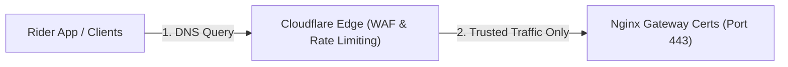

# Production Deployment & Security Configuration (Documents/infrastructure/PRODUCTION-DEPLOYMENT.md)

คู่มือเล่มนี้รวบรวมแนวทางปฏิบัติที่ดีที่สุด (Best Practices) ด้านความปลอดภัยและการนำระบบขึ้นทำงานจริงบนสภาพแวดล้อมโปรดักชัน (Production Deployment)

---

## 1. การแยกแยะพอร์ตและความปลอดภัยเน็ตเวิร์ก (Port Isolation & Network Security)

ความปลอดภัยระดับโครงสร้างพื้นฐานขึ้นอยู่กับนโยบาย **API Isolation** เพื่อป้องกันผู้ใช้ที่ไม่พึงประสงค์สืบค้นข้อมูลหรือรบกวนฐานข้อมูลหลักโดยตรง

### 1.1 การป้องกันบน Base Config (`docker-compose.yml`)
- **แนวทางปฏิบัติ:** ไฟล์ [docker-compose.yml](../../docker-compose.yml) หลักจะต้อง **ไม่มี** การประกาศพารามิเตอร์ `ports:` สำหรับบริการที่เป็นภายใน (Internal Services) เช่น `db`, `pgbouncer`, `redis`, `rabbitmq`, `vault`, `prometheus`, `alertmanager`
- **ผลลัพธ์:** คอนเทนเนอร์เหล่านี้จะคุยกันผ่านชื่อบริการภายใน Docker Network ส่วนตัวเท่านั้น ทำให้พอร์ตเหล่านี้ไม่ถูกเปิดรับทราฟฟิกจากอินเทอร์เน็ตภายนอกเครื่องโฮสต์

### 1.2 การกำหนดเฉพาะสำหรับการพัฒนา (`docker-compose.override.yml`)
- **แนวทางปฏิบัติ:** พอร์ตพัฒนาเชิงเชื่อมต่อตรง (เช่น `5432`, `6379`, `15672`, `9090`) จะถูกประกาศไว้ในไฟล์เฉพาะที่เรียกว่า [docker-compose.override.yml](../../docker-compose.override.yml) เท่านั้น
- **การจำกัดไอพีเชื่อมต่อ:** ทุกการเชื่อมต่อพอร์ตในไฟล์ override จะต้องถูกผูกเข้ากับที่อยู่ **`127.0.0.1` (localhost)** เท่านั้น เพื่อป้องกันไม่ให้คนขับรถหรือบุคคลอื่นในวง LAN หรือเน็ตเวิร์กสาธารณะสแกนพอร์ตเจอ
  - *ตัวอย่างที่ถูกต้อง:* `"127.0.0.1:5432:5432"`
  - *ตัวอย่างที่ห้ามทำบน Production:* `"0.0.0.0:5432:5432"` (จะทำให้อินเทอร์เน็ตเข้าถึงฐานข้อมูลตรงๆ ได้)

---

## 2. การตั้งค่าความปลอดภัย SSL/TLS บน Nginx Proxy

บนเซิร์ฟเวอร์จริง Nginx Proxy (ตู้ Gateway ขาเข้า) จะต้องผ่านกระบวนการเข้ารหัสสัญญาณข้อมูลทั้งหมดเพื่อป้องกันการดักจับพิกัดระหว่างเดินทาง (Man-in-the-Middle Attack)

### 2.1 การเขียนตั้งค่า Nginx Certs
- **ตำแหน่งไฟล์:** [nginx-proxy/nginx.conf](../../nginx-proxy/nginx.conf)
- **ตัวอย่างรูปแบบคอนฟิกการเข้ารหัส (SSL Configuration Block):**

```nginx
server {
    listen 80;
    server_name api.delivery.yourdomain.com;
    
    # บังคับอัปเกรดเป็น HTTPS เสมอ
    return 301 https://$host$request_uri;
}

server {
    listen 443 ssl http2;
    server_name api.delivery.yourdomain.com;

    # ตำแหน่งใบรับรองความปลอดภัย (SSL Certificates)
    ssl_certificate /etc/nginx/certs/live/api.delivery.yourdomain.com/fullchain.pem;
    ssl_certificate_key /etc/nginx/certs/live/api.delivery.yourdomain.com/privkey.pem;

    # รูปแบบรหัสลับความปลอดภัยที่แนะนำ (Cipher Suite Settings)
    ssl_protocols TLSv1.2 TLSv1.3;
    ssl_prefer_server_ciphers on;
    ssl_ciphers "EECDH+AESGCM:EDH+AESGCM:AES256+EECDH:AES256+EDH";

    location / {
        proxy_pass http://backend:80;
        proxy_http_version 1.1;
        proxy_set_header Upgrade $http_upgrade;
        proxy_set_header Connection "upgrade";
        proxy_set_header Host $host;
        proxy_set_header X-Real-IP $remote_addr;
        proxy_set_header X-Forwarded-For $proxy_add_x_forwarded_for;
        proxy_set_header X-Forwarded-Proto $scheme;
    }
}
```

---

## 3. การประสานงานร่วมกับ Cloudflare CDN & WAF (Web Application Firewall)

เพื่อความมั่นใจในการให้บริการและความสามารถในการกันสแปมพิกัด GPS (DDoS / Telemetry Spam Protection) แนะนำให้ใช้สถาปัตยกรรมขอบเน็ตเวิร์ก (Edge Security) ของ Cloudflare:



### 3.1 การกำหนดกฎ Rate Limiting บน Cloudflare
1.  **พิกัดสดของไรเดอร์ (GPS Telemetry Ingestion):**
    *   **เส้นทางเฝ้าระวัง:** `api.delivery.yourdomain.com/api/v1/telemetry/gps`
    *   **กฎจูนแต่ง:** จำกัดที่ 2 คำขอต่อวินาทีต่อ Client IP หากมีการยิงถี่กว่านั้นให้บล็อกคำขอชั่วคราว 1 นาที เพื่อป้องกันการยิง DDoS ถล่มคิวของ RabbitMQ
2.  **นโยบายความปลอดภัยของ API ทั่วไป:**
    *   จำกัดปริมาณทราฟฟิกรวมที่ 120 คำขอต่อนาทีสำหรับผู้ใช้งานทั่วไป

### 3.2 การกำหนดขีดจำกัดขนาดข้อมูลที่อนุญาต (Security Body Limits)
- ตั้งค่า `client_max_body_size` บน Nginx และระดับ Application API ขาเข้าไว้สูงสุดเพียง **16 KB** สำหรับ Endpoint รับพิกัด (Ingestion Endpoint) เพื่อสกัดกั้นการอัปโหลดไฟล์ขนาดใหญ่ผิดปกติเข้ามาถล่ม Memory ของแอปพลิเคชัน
- ปล่อยใช้งาน Double-submit CSRF Tokens และ HttpOnly Secure Cookie สำหรับผู้ใช้งานระดับแอดมินบอร์ด
