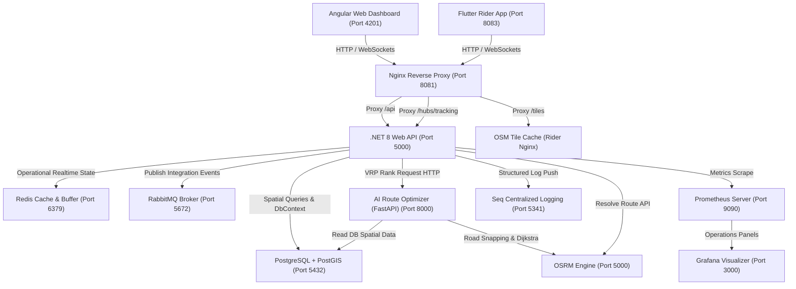
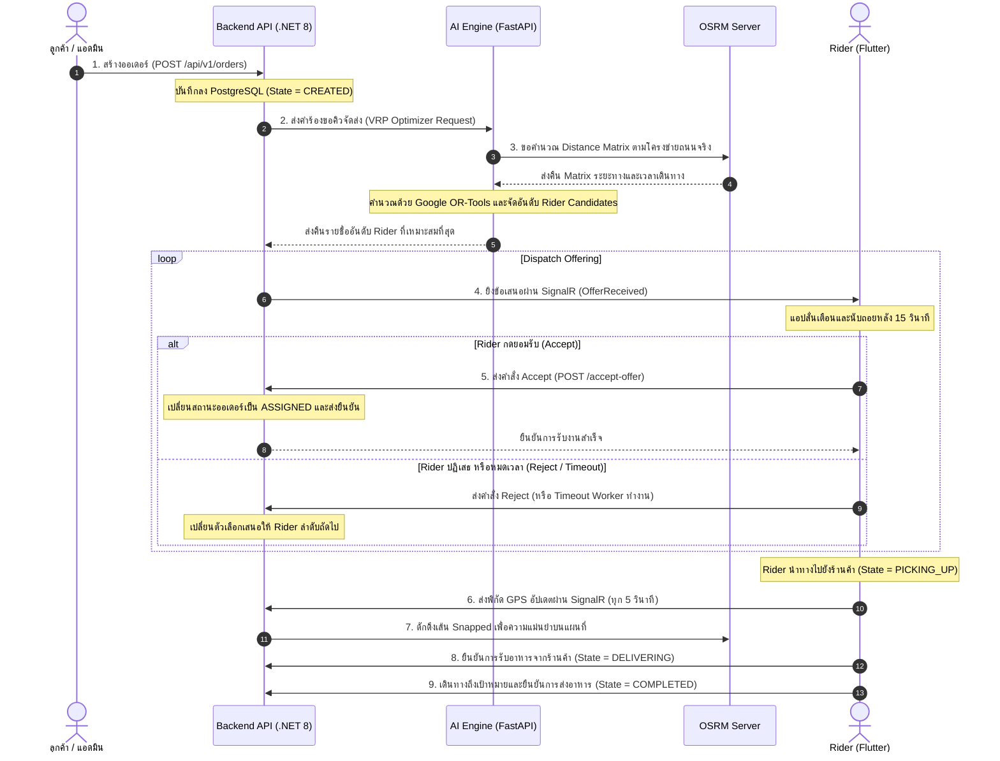

# Smart Delivery Routing System (ระบบจัดส่งอัจฉริยะแบบเรียลไทม์)

> [!NOTE]
> เอกสารฉบับนี้เป็น **Master Table of Contents (สารบัญหลักประจำโปรเจกต์)** ออกแบบมาเพื่อให้ผู้บริหารโครงการ (Project Manager), นักพัฒนาซอฟต์แวร์ (Developers) และทีมผู้ดูแลระบบ (DevOps/SysAdmin) สามารถทำความเข้าใจภาพรวมและระบบงานทั้งหมดได้ภายใน 2 นาที

---

## 1. คำอธิบายโครงการ (Project Description)
**Smart Delivery Routing System** คือระบบบริหารจัดการและจัดส่งสินค้าเรียลไทม์ประสิทธิภาพสูง ที่ออกแบบมารองรับการจับคู่ออเดอร์ระหว่างร้านค้า ลูกค้า และพนักงานขับรถ (Rider) โดยใช้ปัญญาประดิษฐ์ (AI Route Optimizer) ร่วมกับข้อมูลโครงข่ายถนนจริง (OSRM) เพื่อคำนวณและแจกจ่ายงานให้กับ Rider ที่เหมาะสมที่สุดในพื้นที่ ช่วยเพิ่มความเร็วในการจัดส่ง ลดระยะการเดินทาง และรองรับการทำงานแบบออฟไลน์ (Offline-First Telemetry Sync) ในกรณีสัญญาณเครือข่ายขัดข้อง

---

## 2. แผนภาพสถาปัตยกรรมระดับสูง (High-Level Architecture)
ระบบถูกออกแบบภายใต้สถาปัตยกรรม **Docker-based Microservices** ที่แยกส่วนการทำงานเป็นระบบย่อย และคุยกันผ่านโปรโตคอลมาตรฐาน ดังแผนภาพนี้:

---

## 3. กระแสข้อมูลทางธุรกิจหลัก (Core Business Flow)
กระบวนการจัดส่งตั้งแต่เริ่มต้นออเดอร์จนถึงการจัดส่งสำเร็จมีขั้นตอนดังนี้:

---

## 4. ตารางสรุปเทคโนโลยีที่ใช้ (Technology Stack)

| ส่วนของระบบ (Component) | เทคโนโลยีหลัก (Core Tech Stack) | หน้าที่และความรับผิดชอบ (Role) |
| :--- | :--- | :--- |
| **Backend API** | `.NET 8`, `EF Core`, `SignalR NetCore`, `Npgsql` | ควบคุมสิทธิ์การใช้งาน (Auth), โมเดลธุรกิจ, และการสื่อสารข้อมูลพิกัดความเร็วสูง |
| **AI Engine** | `Python 3.11`, `FastAPI`, `Google OR-Tools` | อัลกอริทึมจับคู่ออเดอร์พนักงาน (Vehicle Routing Problem) |
| **Admin Dashboard** | `Angular 19`, `RxJS`, `Leaflet.js` | หน้าจอแอดมินสำหรับเฝ้าดูตำแหน่งพิกัดและเส้นทางแบบสดๆ |
| **Rider Mobile App** | `Flutter 3.x`, `Riverpod`, `SQLite`, `Geolocator` | แอปพลิเคชันบนมือถือของคนขับ รองรับระบบทำงานแบบ Offline-First |
| **Routing Engine** | `OSRM (Open Source Routing Machine)` | บริการวิเคราะห์เส้นทางถนนจริง (จังหวัดอุดรธานี) |
| **Data Storage** | `PostgreSQL 15 + PostGIS`, `Redis` | ฐานข้อมูลถาวรเชิงพื้นที่ (GIS) และแคชจัดเก็บพิกัดล่าสุดแบบความเร็วสูง |
| **DevOps & Infra** | `Docker Compose`, `Nginx` | ระบบเครือข่ายจำลองและเกตเวย์ควบคุมความปลอดภัยของพอร์ต |
| **Observability** | `Grafana`, `Prometheus`, `Seq Centralized Logs` | ระบบตรวจสอบความเสถียร สถิติ (SLO) และตรวจสอบข้อผิดพลาด (Debug Logs) |

---

## 5. ดัชนีเอกสารโครงการ (Directory Index)

กรุณาคลิกเลือกอ่านเอกสารอ้างอิงและคู่มือเฉพาะส่วนที่ท่านเกี่ยวข้องด้านล่างนี้ โดยไม่ต้องสืบค้นในโฟลเดอร์หลักด้วยตัวเอง:

### 🏛️ คู่มือระบบย่อย (Subsystem Handover Guides)
*   **สำหรับนักพัฒนา Backend (.NET):**  
    👉 [Backend API Subsystem Manual](BackendApi/README.md)  
    *(ข้อมูลการทำ DB Migrations, โครงสร้าง DbContext, ลอจิก DispatchService และ SignalR Hub)*
*   **สำหรับนักพัฒนา Frontend (Angular):**  
    👉 [Angular Admin Dashboard Manual](admin-dashboard/README.md)  
    *(ลอจิกการวาดแผนที่ Canvas, การรับข้อมูล SignalR แบบรีแอคทีฟ และการป้องกัน Memory Leak)*
*   **สำหรับนักพัฒนา Mobile (Flutter):**  
    👉 [Flutter Rider App Manual](rider_app/README.md)  
    *(สถาปัตยกรรม Riverpod, การทำงานเบื้องหลัง GPS Background, SQLite Buffer และระบบ Anti-Spoofing)*
*   **สำหรับนักพัฒนา AI (Python/Data Science):**  
    👉 [AI Engine Subsystem Manual](ai-engine/README.md)  
    *(การตั้งค่า VRP Solver, การคำนวณ Distance Matrix และการใช้งานระบบสำรอง Haversine)*

### ⚙️ คู่มือสำหรับ DevOps & SysAdmin
*   **สำหรับทีม Deploy & Infra:**  
    👉 [DevOps & Infrastructure Deployment Manual](README-DEVOPS.md)  
    *(ข้อมูล Docker Topology, Nginx Proxy Rules, Prometheus Exporters และบอร์ดเตือนภัยวิกฤต Critical 9)*
*   **คู่มือเกตเวย์จราจร Nginx (Nginx Ingress Proxy Guide):**  
    👉 [Nginx Reverse Proxy Subsystem Manual](nginx-proxy/README.md)  
    *(นโยบายความปลอดภัย Headers, การตั้งค่า Rate Limiting ป้องกัน DDoS และ Basic Auth)*
*   **คู่มือฐานข้อมูลหลัก (PostgreSQL & PgBouncer Manual):**  
    👉 [PostgreSQL & PgBouncer Database Manual](Documents/setup/DATABASE-SETUP.md)  
    *(การตั้งค่าตาราง GIS PostGIS, สระจำลองธุรกรรม PgBouncer Transaction Mode และการย้าย DDL)*
*   **คู่มือแคชความเร็วสูง (Redis Cache & Locking Manual):**  
    👉 [Redis Cache & Lock Database Manual](Documents/setup/REDIS-SETUP.md)  
    *(สเปกคีย์ไรเดอร์ TTL, Lua Script ของระบบล็อก RedLock และนโยบาย volatile-lru)*
*   **คู่มือระบบส่งข้อความคิว (RabbitMQ Message Broker Manual):**  
    👉 [RabbitMQ Event Broker Subsystem Manual](rabbitmq/README.md)  
    *(สัญญากำหนดชื่อ Integration Events, ระบบ Dead Letter Exchange และระบบเช็คคิว ProcessedEvents)*
*   **คู่มือศูนย์วิเคราะห์ประวัติล็อก (Seq Centralized Logging Manual):**  
    👉 [Seq Centralized Logging Manual](Documents/setup/SEQ-SETUP.md)  
    *(การตั้งค่า Serilog Sink ข้อมูลหลังบ้าน, การสืบจับรอย Correlation ID และตัวอย่างคิวรีหาข้อยกเว้น)*
*   **คู่มือแผนที่จราจร OSRM (OSRM Map Guide):**  
    👉 [OSRM Map Data & Setup Reference](Documents/setup/OSRM-SETUP.md)  
    *(ข้อมูล assets แผนที่, คำสั่งดาวน์โหลด/คอมไพล์โครงข่ายถนนจังหวัดอุดรธานี และ Docker volumes)*
*   **คู่มือตัวจัดเก็บตัววัดค่าระบบ (Prometheus Metrics Manual):**  
    👉 [Prometheus Metrics Subsystem Manual](prometheus/README.md)  
    *(การตั้งค่า scrape jobs ของ exporters ทั้ง 4, กฎการ evaluate ล็อกเตือนภัยคุกคามและความเสถียร)*
*   **คู่มือระบบตรวจสอบกราฟ (Grafana Dashboards):**  
    👉 [Grafana Dashboards Subsystem Manual](grafana/README.md)  
    *(โครงสร้าง Automated Provisioning, ข้อมูลบอร์ดสรุปสถิตินำทาง และแผงเตือนภัยพิบัติทั้ง 7 บอร์ด)*
*   **คู่มือคัดกรองจัดกลุ่มแจ้งเตือน (Alertmanager Notification Manual):**  
    👉 [Alertmanager Notification Subsystem Manual](alertmanager/README.md)  
    *(เงื่อนไขเวลาคั่งค้าง Resolve Timeout, การจัดกลุ่ม Alert และการเชื่อมโยงระบบเตือนเข้า Discord Webhook)*
*   **คู่มือความเสถียร (Scale Guide):**  
    👉 [Scale Guide & Performance Tuning Manual](Documents/infrastructure/SCALE-GUIDE.md)  
    *(การจูน CPU/RAM คอนเทนเนอร์ และแคช Eviction Limits)*
*   **คู่มือความปลอดภัยและการขึ้นจริง:**  
    👉 [Production Deployment & Security Guidelines](Documents/infrastructure/PRODUCTION-DEPLOYMENT.md)  
    *(การแยกพอร์ต IP, การเข้ารหัส SSL/TLS และกฎการกัน DDoS ด้วย Cloudflare WAF)*
*   **คู่มือการเก็บรักษาข้อมูลถาวรในเครื่อง (PostgreSQL Persistent Storage):**  
    👉 [PostgreSQL Persistent Storage Directory (postgres-data/README.md)](postgres-data/README.md)  
    *(การ Mount โวลลุ่มฐานข้อมูล Docker และข้อควรระวังเพื่อรักษาความถูกต้องทางกายภาพของไฟล์ข้อมูล)*

### 💻 คู่มือด้านโค้ดเบสและสคริปต์เสริม (Codebase & Script Manuals)
*   **สคริปต์อัตโนมัติประจำระบบ:**  
    👉 [System Helper & Bootstrap Scripts (RootScripts/scripts/README.md)](RootScripts/scripts/README.md)  
    *(คู่มือการใช้งานสคริปต์สตาร์ตระบบทั้งหมด สคริปต์สตาร์ตหลังบ้าน สคริปต์ดาวน์โหลดแผนที่ และสคริปต์สแกนความปลอดภัย)*
*   **คู่มือโครงสร้างบริการทำ Migration ของฐานข้อมูลเชิงลึก:**  
    👉 [Custom Database Migration Service Technical Guide](Documents/development/MIGRATION-SERVICE.md)  
    *(คำอธิบายระบบการทำ Table Partitioning, Clustering และ Indexing อัตโนมัติใน PostgresAdvancedConfigurator.cs)*
*   **คู่มืออธิบายโครงสร้างลอจิกและสถาปัตยกรรมโค้ดเบสหลัก:**  
    👉 [Core Codebase Patterns & Architecture Technical Manual Directory](Documents/development/CODEBASE_PATTERNS/README.md)  
    *(คู่มืออธิบายรูปแบบโครงสร้างโค้ดแยกย่อย: Base Controllers, Base Services, Middlewares/Headers, Validation & GIS index, Mapster, FastAPI Threading, Auto migrations, ThreadPool starvation, Idempotency, Concurrency locks, Frontend memory leaks และ trace logging)*

### 🧪 คู่มือการรันชุดทดสอบ (QA & Testing Center)
*   **สำหรับทีมควบคุมคุณภาพและ QA:**  
    👉 [QA Test Map & Execution Manual](RootScripts/scripts.test/README.md)  
    *(วิธีการรัน C# Integration, Python AI Engine, Node.js E2E Simulators และสถิติล็อกของห้องแล็บ)*

---

### 📂 เอกสารข้อกำหนดและการทำงานเชิงลึกดั้งเดิม (System Spec & Contracts)
> [!IMPORTANT]
> เอกสารดั้งเดิมยังคงจัดเก็บไว้อยู่ในไดเรกทอรี `.docs/ai-context/` เพื่อเป็นฐานอ้างอิงสัญญาระหว่างระบบ (Contract Reference)
> *   [API REST Contracts & DTO Rules](.docs/ai-context/contracts/api-contracts.md)
> *   [SignalR WebSockets Hub Events Contract](.docs/ai-context/contracts/signalr-contracts.md)
> *   [State Machine & Order Transition Rules](.docs/ai-context/contracts/state-machine.md)
> *   [Redis Key-Value Design and TTL Limits](.docs/ai-context/contracts/redis-keys.md)
> *   [GeoJSON Coordinate Standard & Polyline Format](.docs/ai-context/contracts/geojson-contracts.md)
