# Test Dashboard Hybrid Runtime

Internal test dashboard runs as local dev processes, while test execution still uses short-lived Docker containers.

## Architecture

- Local: Angular dashboard, Node API, BullMQ worker
- Docker: Redis, PostgreSQL/PostGIS, OSRM, Backend API, Route Optimizer
- Ephemeral Docker: pytest, dotnet test, load/stress runners

### End-to-End Execution Flow

```mermaid
sequenceDiagram
    participant UI as Angular Dashboard<br/>(Frontend)
    participant API as Express API<br/>(Backend)
    participant Redis as Redis Queue<br/>(BullMQ)
    participant Worker as Node Worker<br/>(DockerExecution)
    participant Sandbox as Ephemeral Container<br/>(Docker)

    UI->>API: 1. POST /api/test/run { suiteType }
    API->>Redis: 2. Enqueue Job
    Redis->>Worker: 3. Dequeue Job
    Worker->>Worker: 4. Read sandbox-policy.json
    Worker->>Sandbox: 5. docker run (Isolated Env)
    
    rect rgb(0, 50, 80)
        Note right of Sandbox: Test Execution Phase
        Sandbox-->>Worker: 6. Stream Live Terminal Logs (Socket.IO)
        Worker-->>UI: 7. Real-time Telemetry Display
        Sandbox->>Sandbox: 8. Save structured report to /tmp (TRX/JSON)
    end
    
    Worker->>Sandbox: 9. Extract /tmp archive via tar-stream
    Worker->>Worker: 10. Parse TRX/JSON into detailed Test Cases
    Worker->>Sandbox: 11. container.remove() (Strict Cleanup)
    Worker->>UI: 12. Emit Final Results & Render Chart.js
```



### File-Level Data Flow (How Data Moves)

```mermaid
graph TD
    %% Define Styles
    classDef frontend fill:#dd0031,stroke:#c3002f,stroke-width:2px,color:#fff
    classDef backend fill:#68a063,stroke:#3c873a,stroke-width:2px,color:#fff
    classDef config fill:#f0db4f,stroke:#e3c417,stroke-width:2px,color:#000
    classDef sandbox fill:#0db7ed,stroke:#099edb,stroke-width:2px,color:#fff
    classDef storage fill:#ff9800,stroke:#f57c00,stroke-width:2px,color:#fff

    A[Angular UI<br/>(app.component.ts)]:::frontend -- "1. POST /api/test/run" --> B[Express Server<br/>(server.ts)]:::backend
    B -- "2. Queue Job" --> C[(Redis Queue)]:::storage
    C -- "3. Process Job" --> D[Test Worker<br/>(worker.ts)]:::backend
    
    E[sandbox-policy.json]:::config -. "4. Read rules & cmd" .-> D
    
    D -- "5. Create Isolated Env" --> F[Docker Execution Engine<br/>(docker-execution.ts)]:::backend
    
    subgraph Ephemeral Docker Sandbox
        F -- "6. Execute Script" --> G[Test Runners<br/>dotnet, pytest, node]:::sandbox
        G -- "7. Generate Report" --> H[/tmp/results.json or .trx]:::sandbox
    end
    
    H -- "8. Read stream (tar-stream)" --> F
    F -- "9. Raw String/Buffer" --> D
    
    D -- "10. Parse (xml2js / JSON.parse)<br/>Map to TestCase[]" --> I[Artifact Service<br/>(artifact.service.ts)]:::backend
    
    I -- "11. Save Summary" --> J[(data/sessions.json)]:::storage
    I -- "12. Save Detailed Report" --> K[(data/reports/.../report.json)]:::storage
    
    D -- "13. Emit Socket.IO 'status'" --> A
    A -- "14. Fetch Detailed Report" --> B
    B -- "15. Return TestCase[]" --> K
    A -- "16. Draw Chart.js" --> L[Browser Canvas]:::frontend
```

### Phase 5: Data-Driven Observability & Metrics

To capture real-time performance metrics during load and stress tests, the system utilizes a `LogParserService` inside the backend worker to continuously monitor STDOUT streams from the ephemeral containers.

```mermaid
graph TD
    classDef frontend fill:#dd0031,stroke:#c3002f,stroke-width:2px,color:#fff
    classDef backend fill:#68a063,stroke:#3c873a,stroke-width:2px,color:#fff
    classDef storage fill:#ff9800,stroke:#f57c00,stroke-width:2px,color:#fff

    A[Sandbox Stream]:::backend -- "Buffer" --> B[LogParserService<br/>(regex processing)]:::backend
    B -- "Extract (RPS, Latency, Errors)" --> C[Redis / Artifacts]:::storage
    C -- "Socket.IO Broadcast" --> D[Angular UI<br/>(MetricsChartComponent)]:::frontend
    D -- "Render via Chart.js" --> E[Gauge & Line Charts]:::frontend
```

**Key mechanisms**:
1. **Log Batching & Throttling:** Handled by `api-server/server.ts` to accumulate high-frequency log messages and emit them in 500ms batches, preventing the Angular UI from freezing during massive log storms (e.g., 5,000+ RPS).
2. **Terminal Highlighting:** `LiveTerminalComponent` uses Regex patterns to automatically inject ANSI color codes for keywords such as `Error`, `Timeout`, `Passed`, and `BREAKING POINT`.
3. **Regex Metric Parsing:** `LogParserService` scans for standardized patterns (`Current RPS: XXX`, `p95 Latency: XXX ms`) and updates the `TestSession.metrics` payload for Chart.js to render.

## Start

1. Start infra from repo root:

```powershell
docker compose up -d
```

2. Start dashboard processes:

```powershell
.\RootScripts\scripts.test\test\test-dashboard\scripts\start-local.ps1
```

Or run them manually:

```powershell
cd RootScripts\scripts.test\test\test-dashboard\backend
npm.cmd run dev:api
npm.cmd run dev:worker

cd ..\frontend
npm.cmd start
```

## URLs

- Frontend: http://localhost:4200
- API: http://localhost:3001

## Security

The frontend sends only a suite key such as `python`, `csharp`, `load`, or `simulator`.
The worker reads the allowlist in `backend/config/sandbox-policy.json` and launches only approved Docker images/commands.
