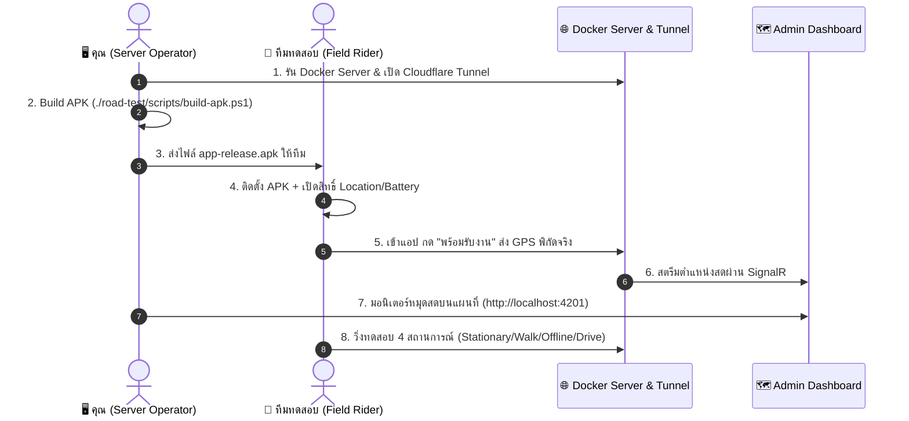

# 🚀 Quick Start & Field Testing Manual (คู่มือปฏิบัติการทดสอบภาคสนาม)

> **สำหรับ:** ผู้ควบคุมเซิร์ฟเวอร์ (Server Operator) และ ทีมไรเดอร์ทดสอบวิ่งจริง (Field Test Riders)  
> **โปรเจกต์:** AI-Optimized Smart Delivery Routing — Real Road Test  

---

## 🧭 สรุปภาพรวมและผังการทำงาน (Workflow Overview)



---

## 👨‍💻 ส่วนที่ 1: สำหรับคุณ (Server Operator & Monitoring)

### 1.1 Checklist ก่อนเริ่มการทดสอบ (Pre-flight Checklist)

- [ ] **Docker Test Server:** ทุก Service กำลังทำงานและมีสถานะ Healthy
  ```powershell
  powershell ./road-test/scripts/health-check.ps1
  ```
- [ ] **Cloudflare Tunnel:** หน้าต่าง Terminal ที่รันคำสั่ง Cloudflare Tunnel **ต้องเปิดค้างไว้ตลอดการทดสอบ** (ห้ามปิดหน้าต่าง)
  ```bash
  cloudflared tunnel --url http://localhost:80
  ```
- [ ] **Release APK:** ได้รับการ Build ด้วย Tunnel URL ล่าสุดแล้ว
  ```powershell
  powershell ./road-test/scripts/build-apk.ps1 -TunnelUrl "https://soldier-competitive-transport-oregon.trycloudflare.com"
  ```
  *(ไฟล์ผลลัพธ์อยู่ที่: `rider_app/build/app/outputs/flutter-apk/app-release.apk`)*

### 1.2 การมอนิเตอร์ระหว่างการทดสอบ (Live Monitoring)

1. เปิดเบราว์เซอร์ไปที่: **`http://localhost:4201`** (Admin Web Map)
2. เข้าสู่ระบบเพื่อดูหน้าจอแผนที่
3. เมื่อทีมไรเดอร์กด **"พร้อมรับงาน"** หมุดไรเดอร์จะปรากฏขึ้นบนแผนที่ และเคลื่อนที่ตามตำแหน่งจริงแบบ Real-time (SignalR)
4. สังเกตเส้นทาง Breadcrumb Track ว่าลากต่อเนื่องตามเส้นทางถนนจริงหรือไม่

---

## 🛵 ส่วนที่ 2: สำหรับทีมผู้ทดสอบภาคสนาม (Field Test Riders)

> 💬 **ข้อความสรุปส่งให้ทีมทาง LINE / Discord / Chat:**
> 
> ```text
> 🛵 คู่มือติดตั้งและทดสอบ Rider App (Real Road Test)
> 1. ดาวน์โหลดไฟล์ app-release.apk และกดติดตั้งลงเครื่อง
> 2. เข้า Settings มือถือ -> ตั้งค่าสิทธิ์แอป:
>    - Location (ตำแหน่ง): "Allow all the time" (อนุญาตตลอดเวลา)
>    - Battery: "Unrestricted" (ไม่จำกัดการทำงานเบื้องหลัง)
> 3. เปิดแอป -> ล็อกอิน -> กดปุ่ม "พร้อมรับงาน"
> 4. วิ่งทดสอบตาม 4 สเต็ปด้านล่าง
> ```

### 2.1 การติดตั้งและให้สิทธิ์ (สำคัญมาก ⚠️)

| การตั้งค่า | วิธีการเลือก | เหตุผลที่จำเป็น |
|---|---|---|
| **Location Permission** | เลือก **"Allow all the time"** (อนุญาตตลอดเวลา) | เพื่อให้แอปส่งพิกัดดาวเทียมได้แม้พับแอปหรือล็อกหน้าจอ |
| **Battery Optimization** | เลือก **"Unrestricted"** (ไม่จำกัด) | เพื่อป้องกัน Android OS ปิดแอปขณะทำงานในพื้นหลัง |

---

### 2.2 ลำดับขั้นตอนการทดสอบ 4 สถานการณ์ (Test Runbook)

| ขั้นตอน | การปฏิบัติของไรเดอร์ | ผลลัพธ์ที่ถูกต้อง (Expected Result) | สถานะ |
|---|---|---|:---:|
| **Test A: อยู่นิ่งกลางแจ้ง (Stationary)** | 1. ยืน/วางมือถือในที่โล่งแจ้งเปิด 4G/5G<br>2. ล็อกอินเข้าแอปแล้วกด **"พร้อมรับงาน"** | พิกัด ละติจูด/ลองจิจูด แสดงถูกต้อง, Accuracy < 15 เมตร, หมุดแสดงบน Admin Map | [ ] |
| **Test B: ทดสอบการเดิน (Walking)** | 1. ถือโทรศัพท์เดิน 100 – 500 เมตร<br>2. ดูหน้าจอว่าพิกัดขยับตาม | หมุดบนแผนที่เคลื่อนที่ตามแนวการเดินแบบ Real-time เส้นทางไม่กระโดด | [ ] |
| **Test C: จำลองเน็ตหลุด (Offline Buffer)** | 1. **ปิด 4G/5G และ Wi-Fi** (เข้าสู่โหมดออฟไลน์)<br>2. เคลื่อนที่ต่อ 200 – 300 เมตร<br>3. **เปิด 4G/5G กลับมา** | ขณะเน็ตหลุดพิกัดเก็บลงเครื่อง พอเน็ตกลับมา แอปยิง Batch อัปโหลดเติมเต็มเส้นทางครบ 100% | [ ] |
| **Test D: ขับขี่ + ล็อกหน้าจอ (Driving & Background)** | 1. ขับขี่ยานพาหนะความเร็ว 30–60 km/h<br>2. **กดล็อกหน้าจอโทรศัพท์ (Lock Screen)** หรือสลับไปใช้แอปอื่น<br>3. ขับต่อ 1–2 กม. แล้วปลดล็อก | การแจ้งเตือน Background Service ยังคงทำงานตลอดเวลา เส้นทางบนแผนที่ครบถ้วนสมบูรณ์ | [ ] |

---

## 🛠️ การแก้ไขปัญหาที่พบบ่อย (Troubleshooting & FAQ)

### 1. หมุดบนแผนที่ไม่ขยับ หรือพิกัดไม่ส่งเข้าเซิร์ฟเวอร์
* **สาเหตุ 1:** สิทธิ์ Location ถูกเลือกเป็น "Only while using the app"
  * **วิธีแก้:** ไปที่ Settings ของมือถือ -> Apps -> Rider App -> Permissions -> Location -> เปลี่ยนเป็น **"Allow all the time"**
* **สาเหตุ 2:** Cloudflare Tunnel หลุด หรือ Public URL มีการเปลี่ยนแปลง
  * **วิธีแก้:** เช็คหน้าต่าง Terminal ที่รัน Cloudflare Tunnel หากมีการรีสตาร์ท ให้สั่งรัน `./road-test/scripts/build-apk.ps1 -TunnelUrl <URL_ใหม่>`

### 2. ล็อกหน้าจอแล้วพิกัดขาดหาย
* **สาเหตุ:** มือถือเปิดโหมดประหยัดพลังงาน (Battery Saver / Optimize Battery)
* **วิธีแก้:** ไปที่ App Info -> Battery -> เลือก **"Unrestricted"** (ไม่จำกัด)
